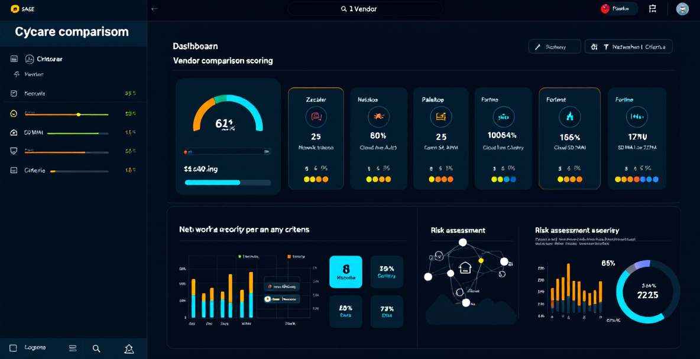

<p align="center">
  
</p>

<h1 align="center">SASE Decision Studio</h1>

<p align="center">
  <strong>Visual scoring, risk matrix, CVE tracking & executive PDF reports for enterprise SASE/SSE vendors.</strong>
</p>

<p align="center">
  <a href="https://pedri77.github.io/sase-visual-app/"></a>
  &nbsp;
  <a href="https://github.com/pedri77/sase-visual-app"></a>
</p>

<p align="center">
  
  
  
  
  
</p>

---

## `> cat overview.md`

Herramienta de evaluacion visual para comparar **5 proveedores SASE/SSE** líderes del mercado, con scoring ponderado, analisis de riesgo basado en CVEs, y generacion de informes PDF ejecutivos.

### Vendors evaluados

| Vendor | Categoria |
|--------|-----------|
| **Zscaler** | SASE / SSE |
| **Netskope** | SASE / SSE / CASB |
| **Palo Alto Networks** | SASE / Prisma Access |
| **Fortinet** | SASE / SD-WAN |
| **Cisco** | SASE / SD-WAN / Umbrella |

---

## `> cat features.md`

```
 Evaluacion                  Reporting                   Seguridad
 ──────────                  ─────────                   ─────────
 Scoring ponderado (1-5)     PDF ejecutivo completo      Matriz de riesgo CVE
 Casos de uso obligatorios   Export por seccion           Respuesta de parches
 Perfiles de cliente          Portada con logo            Incidentes documentados
 Presets de escenario         Enlace copiable             Cifrado por capas
 Persistencia local           Progreso de evaluacion      Evidencia de confianza

 Infraestructura             Compliance                  AI / Quantum
 ──────────────              ──────────                  ──────────
 Implantacion on-premise     ENS Alto                    Valoracion Quantum
 Provision cloud / hibrida   Posicion soberana           Valoracion IA
 Especificaciones tecnicas   Casos de exito publicos     Roadmap tecnologico
```

---

## `> cat workflow.md`

```
┌─────────────┐    ┌──────────────┐    ┌──────────────┐    ┌──────────────┐    ┌──────────────┐
│  1. Cliente  │───▶│  2. Preset   │───▶│  3. Scoring  │───▶│  4. Validar  │───▶│  5. PDF      │
│  Seleccionar │    │  Ajustar     │    │  Panel +     │    │  Riesgos,    │    │  Ejecutivo   │
│  perfil      │    │  pesos       │    │  Ranking     │    │  cifrado, IA │    │  completo    │
└─────────────┘    └──────────────┘    └──────────────┘    └──────────────┘    └──────────────┘
```

1. **Seleccionar perfil** de cliente en la seccion `Cliente`
2. **Aplicar preset** para ajustar pesos y casos imprescindibles (Balanced, Cloud-first, Data-centric, Branch/SD-WAN, Enterprise)
3. **Revisar scoring** en `Panel` y `Scoring` con ranking visual
4. **Validar** funcionalidades, evidencia, riesgos, cifrado, implantacion y quantum/IA
5. **Descargar PDF** ejecutivo completo o por seccion individual

---

## `> tree src/`

```
sase-visual-app/
├── index.html                 # Layout principal y navegacion por secciones
├── styles.css                 # Sistema visual, responsive y animaciones
├── data.js                    # Catalogo editable: fabricantes, criterios, CVEs, evidencias
├── app.js                     # Motor de scoring, graficos, navegacion y PDF
├── icon.svg                   # Icono de la aplicacion
├── manifest.webmanifest       # Configuracion PWA
├── service-worker.js          # Cache estatica para uso offline
├── robots.txt                 # Indexacion SEO
├── sitemap.xml                # Mapa del sitio
├── ARCHITECTURE_ROADMAP.md    # Roadmap: de app estatica a SaaS
└── assets/
    └── preview.png            # Screenshot de la aplicacion
```

---

## `> cat highlights.md`

- **PWA instalable** con cache estatica para uso offline
- **Persistencia local** de pesos, perfil, escenario y casos imprescindibles
- **Deep links** navegables por hash para compartir secciones concretas
- **SEO ready**: canonical, Open Graph, Twitter Card, sitemap
- **Accesibilidad**: enlace de salto al contenido principal
- **CSP**: politica de seguridad de contenido via meta tag
- **Zero dependencies**: vanilla JavaScript, sin frameworks ni build tools
- **Responsive**: adaptado a desktop, tablet y movil

---

## `> cat deploy.md`

Desplegada automaticamente en **GitHub Pages** desde la rama `main`, carpeta raiz.

```bash
# Clonar y servir en local
git clone https://github.com/pedri77/sase-visual-app.git
cd sase-visual-app
# Abrir index.html directamente o servir con:
python3 -m http.server 8080
```

---

## `> cat roadmap.md`

Consulta [`ARCHITECTURE_ROADMAP.md`](ARCHITECTURE_ROADMAP.md) para el plan de evolucion de app estatica a producto SaaS.

---

<p align="center">
  <a href="https://pedri77.github.io/sase-visual-app/"></a>
  &nbsp;&nbsp;
  <a href="https://pedri77.github.io"></a>
</p>

<p align="center">
  <sub>Part of the <a href="https://github.com/pedri77">pedri77</a> cybersecurity & AI portfolio.</sub>
</p>
